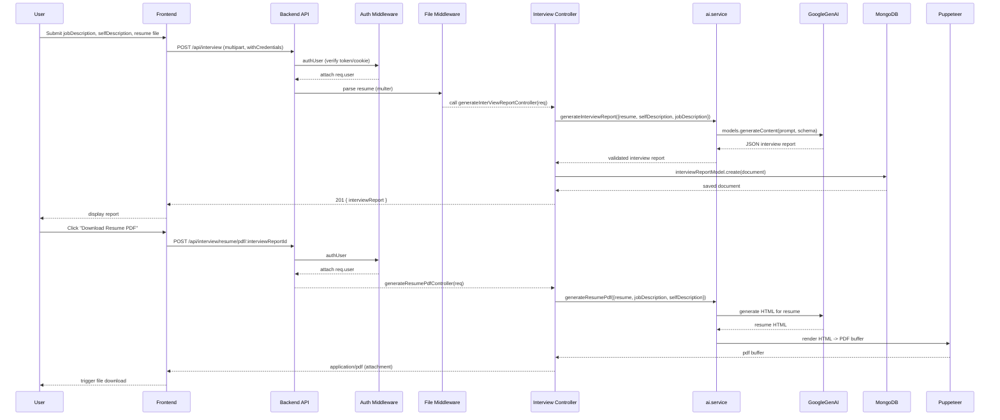

# Backend Context

## Overview
- Express-based API that exposes authentication and interview-report endpoints.
- Uses MongoDB (mongoose) for persistence and Google GenAI + Puppeteer for report generation and PDF rendering.

## Entrypoint
- `server.js` — starts the server and connects to DB (calls `src/config/database`).
- `src/app.js` — configures middleware, CORS, cookie parser, and routes.
- `api/index.js` — serverless adapter for Vercel (wraps `src/app`).

## How it runs
- Development: `npm run dev` from `Backend` (runs `node server.js`).
- Production: `npm start` or deploy via Vercel using `api/index.js`.

## Environment variables (used / important)
- `PORT` — server port (default 3000).
- `FRONTEND_ORIGIN` — allowed CORS origin.
- `GOOGLE_GENAI_API_KEY` — required by `src/services/ai.service.js`.
- `NODE_ENV` — influences PDF generation strategy (puppeteer vs chromium).
- DB connection vars — configured in `src/config/database.js` (Mongo URI, options).

## Key routes (prefix `/api`)
- Auth routes: mounted at `/api/auth` (`src/routes/auth.routes.js`). Typical auth flow and token handling.
- Interview routes: mounted at `/api/interview` (`src/routes/interview.routes.js`):
  - `POST /api/interview/` — (private) upload `resume` and `jobDescription` to generate an interview report (uses `upload` middleware and `auth.middleware`).
  - `GET /api/interview/` — (private) list reports for the authenticated user.
  - `GET /api/interview/report/:interviewId` — (private) fetch single report.
  - `POST /api/interview/resume/pdf/:interviewReportId` — (private) generate resume PDF for a stored report.

## Major services & flow
- `src/services/ai.service.js`:
  - Integrates with `@google/genai` to generate structured JSON interview reports and resume HTML.
  - Validates/generates JSON using `zod` and retries across model fallbacks.
  - Converts HTML to PDF using `puppeteer` / `puppeteer-core` + `@sparticuz/chromium` in production.
- Controller `src/controllers/interview.controller.js`:
  - Extracts text from uploaded PDF (with `pdf-parse`), calls `generateInterviewReport`, persists to Mongo, and returns results.

## Models & persistence
- Mongoose models in `src/models` (e.g. `interviewReport.model.js`, `user.model.js`) persist reports and user data.

## Middlewares
- `src/middlewares/auth.middleware.js` — protects routes and attaches `req.user`.
- `src/middlewares/file.middleware.js` — handles multipart uploads via `multer`.

## Important files
- `server.js` — start script
- `src/app.js` — express app setup
- `api/index.js` — Vercel serverless adapter
- `src/services/ai.service.js` — core AI + PDF logic
- `src/controllers/interview.controller.js` — request handling for interview endpoints
- `src/models/*` — Mongoose schemas

## Run / Test locally
1. From `Backend` install deps: `npm install`.
2. Create `.env` with required vars (see above; check `src/config/database.js` for DB var names).
3. Start dev server:

```powershell
npm run dev
```

## Sequence Diagrams

Below are two concise Mermaid sequence diagrams showing the primary flows: generating an interview report and generating a resume PDF.



## Notes & caveats
- `GOOGLE_GENAI_API_KEY` is required; ai.service throws if missing.
- PDF generation uses different libs for production; ensure `@sparticuz/chromium` works on the target environment.
- Endpoints are protected by cookie-based/auth middleware; ensure frontend runs with `withCredentials: true`.
